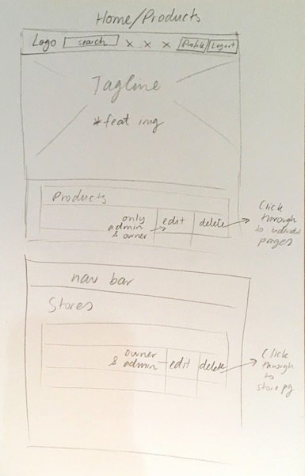
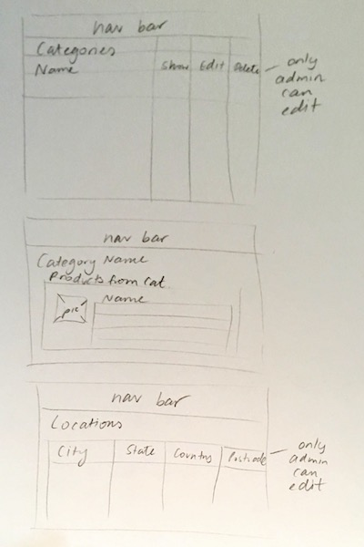
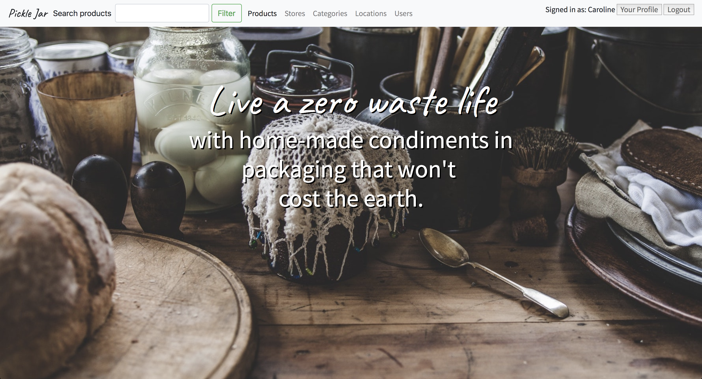

# README
# Overview

1. Summary
2. Installation
3. Requirements
4. User Stories
5. Wireframing
6. Workflow Diagram
7. Entity Relationship Diagram
8. List of Tools Used
9. Project Plan
10. Future Updates

[Link to Pickle Jar on Heroku](pickle-jar.herokuapp.com)  
[Link to Pickle Jar on GitHub](github.com/CaroEvans/Zero_Waste_Shop)

## 1. Summary

### Problem Definition
We currently have a recycling crisis in Australia - in some towns and cities everything is now being sent to land-fill.
An individuals we can make a difference by reducing waste as much as possible.

### Solution
My app makes it easier to reduce waste by providing a two-sided marketplace for buying and selling home-made goods in reusable or biodegradable packaging. An 'admin' user has the power to remove items if they don't fit this description.

## 2. Installation
1. Configure a file called .env in your local root directory with the following:
* POSTGRES_PASSWORD=[INSERT HERE]
* PUBLISHABLE_KEY=[INSERT HERE]
* SECRET_KEY=[INSERT HERE]
* GMAIL_USERNAME=[INSERT HERE]
* GMAIL_PASSWORD=[INSERT HERE]
1. If pushing to a public site add .env to your .gitignore file
1. Clone the repo and move into the directory.
2. Run `bundle install` in your CLI.
3. Run `rails db:migrate` your CLI.

## 3. Requirements

1. Create your application using Ruby on Rails.

1. Demonstrate knowledge of Rails conventions.

1. Use postgresql database in development.

1. Use an API (e.g. Omniauth, Geocoding, Maps, etc).

1. Use appropriate gems.

1. Use environmental variables to protect API keys etc. (dotenv)

1. Implement a payment system for your product. (e.g. Stripe)

1. Your app must send transactional emails (eg. using Mailgun).

1. Your app will have authorisation (users have restrictions on what they can see and edit).

-----------------------

## 4. User Stories

-----------------------

## 5. Wireframing
&nbsp;

-----------------------

## 6. Workflow Diagram

-----------------------

## 7. Entity Relationship Diagram

-----------------------

## 8. List of Tools Used
1. Github - Version control and user stories.
1. Draw.io - ERD
1. Postgres - Database
1. Devise - authentication
1. Bootstrap - styling
1. Heroku - website domain and hosting
1. Gmail - emails
1. Stripe - payments
1. Cloudinary - image hosting
1. CarrierWave - image uploading
1. dotenv-rails - environmental variables1. geocoder - longitude latitude geocoding
1. Google Maps - map locations
1. Rolify - role creation
1. Unsplash - royalty free stock photos

## 9. Bugs/Future Updates
1. Allow visitors to see pages without logging in or signing up - as per workflow diagram.
1. Give buyers way to message sellers.
1. Ensure customers set up a profile first before they can buy - so sellers always have their shipping address.
1. Facilitate shipping and returns.
1. Shopping cart so customers can buy more than one item at a time.
1. Favourites/wish list.

